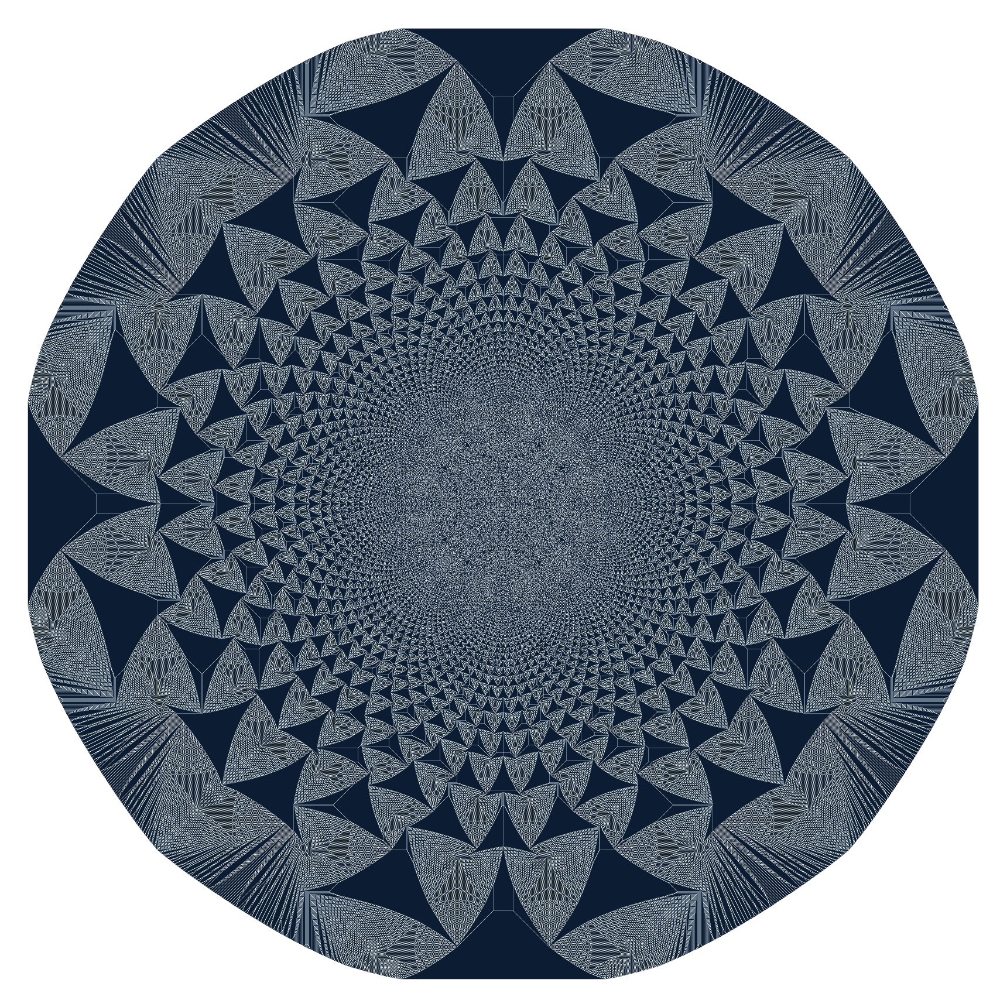

# Sandpiles

## About
This program is written with Ada2012 and requires a Ada2012 GNAT compiler. Also required is an installation of FreeImage for your version of GCC.

## Performance
I gathered statistics to show the how performant my algorithm is, compared to others. The following numbers are from running with 240000 grains.

| Implementation | Time (sec.) | Performance Impact (%) | Brief Description |
|:--------------:|:-----------:|:----------------------:|:-----------------:|
| Simple | 803.82 | Baseline | Basic implementation |
| Moving | 27.19 | 96% | Having a growing plane |
| Better | 168.70 | 79% | Using my algorithm relying on intrinsics and bit manipulation |
| Both | 10.30 | 99% | Moving window with the better algorithm. |

## Installation and Run

Installation is very simple. Once FreeImage and Gnat are installed, simply run gprbuild. The input argument needs to be a multiple of 4 and the grid size needs to be a multiple of 16. Eventhough this is as efficient as I could make it, it took my computer about 2 hours to make the above picture.

On Ubuntu

    sudo apt install libfreeimage-dev
    sudo apt install gnat-5
    gprbuild
    ./main <NUMBER>
